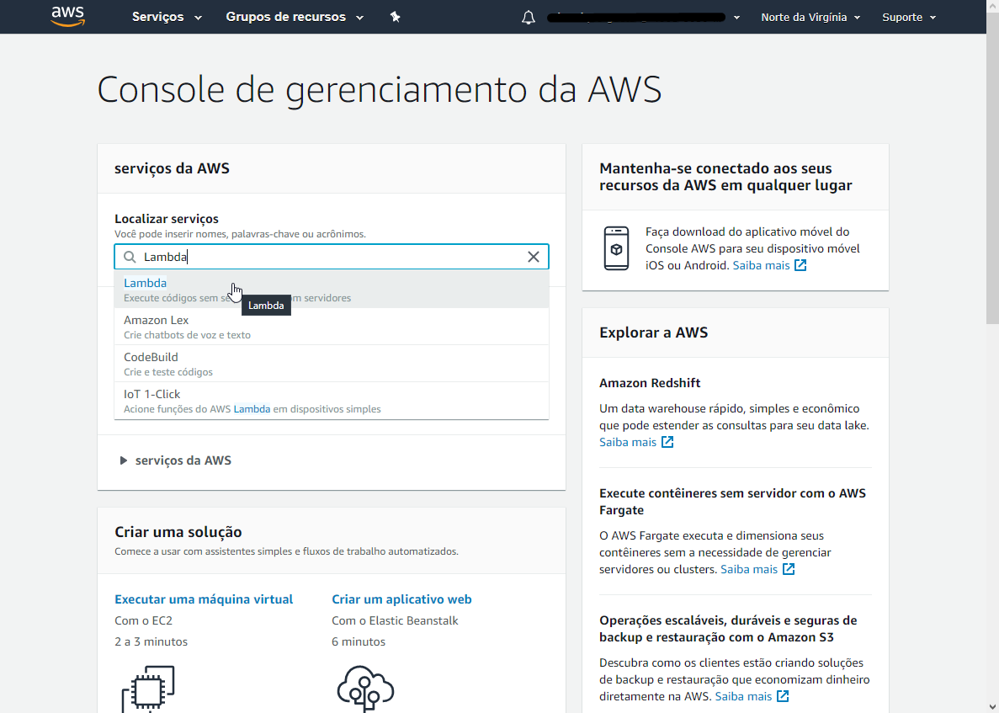
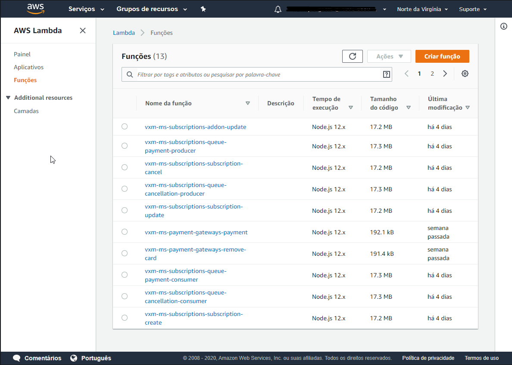
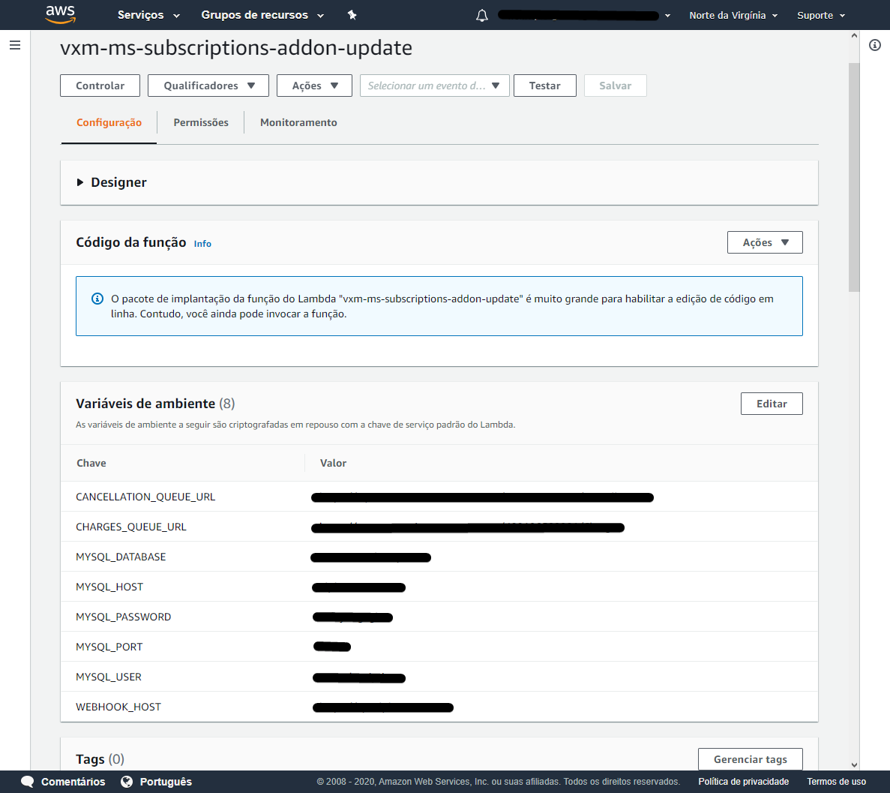
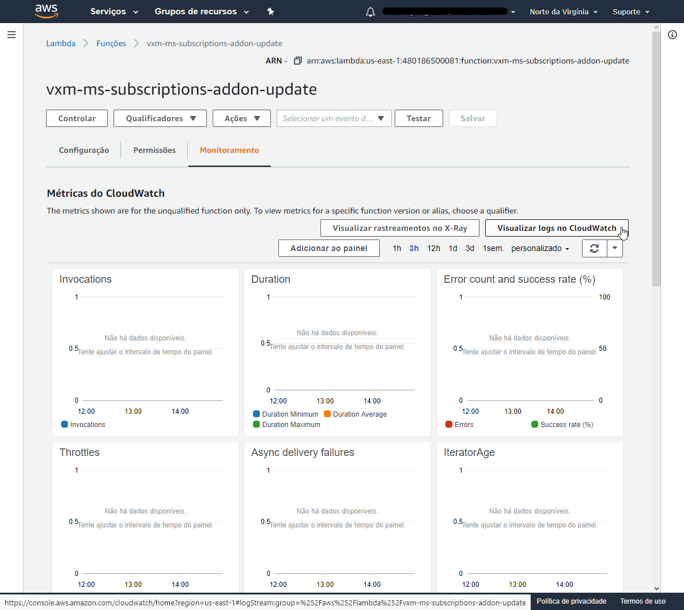

# Sistema de assinatura #

Sistema responsável por gerenciar, realizar a cobrança recorrente e cancelamento o de assinaturas do serviço VoxMe.

### Como realizar a instalação? ###

* Pré requisitos: Node.js.
* Clone o repositório.

```shell
$ git clone `https://youruser@bitbucket.org/askauxilium/vxm_ms_subscriptions.git`
```

* No diretório do projeto clonado execute o comando a seguir para instalar as dependências.

```shell
$ npm install
```

### Testes Unitário
* Para verificar a cobertura dos testes unitários execute na pasta raiz do projeto e na pasta commons.

```shell
$ npm run coverage
```

* Para executar somente os testes unitários.
```shell
$ npm run test 
```

### Desenvolvimento
* No ambiente local podem ser realizados modificações e verificação dos fluxos com os testes.
* Poderão ser inseridos logs (console.log()) para verificar o funcionamento correto dos Lambdas.
* Simulando o ambiente AWS de forma local:
  * Pode ser usado o AWS SAM com Docker que é a solução apresentada pela [AWS](https://docs.aws.amazon.com/serverless-application-model/latest/developerguide/serverless-sam-cli-using-debugging.html).
  * Outra opção é o uso do framework [LocalStack](https://github.com/localstack/localstack).


### CI/CD
* Após as modificações feitas pode-se pedir o pull request para alpha.
* Durante o merge release para alpha o ambiente irá se encarregar de disponibilizar o serviço na AWS.
* Deployments Variables (ver com o douglas).


### AWS
* Ao entrar na AWS procure pelo serviço Lambda.

* Na AWS poderão ser acessados os lambdas do projeto:

  * Assinaturas
    > vxm-ms-subscriptions-subscription-create
    >
    > vxm-ms-subscriptions-subscription-update
    >
    > vxm-ms-subscriptions-subscription-read
    >
    > vxm-ms-subscriptions-subscription-cancel
    >
    > vxm-ms-subscriptions-subscription-reactivate
    >
    > vxm-ms-subscriptions-addon-update

  * Cobrança e cancelamento automático
    > vxm-ms-subscriptions-queue-payment-producer
    >
    > vxm-ms-subscriptions-queue-cancellation-producer
    >
    > vxm-ms-subscriptions-queue-payment-consumer
    >
    > vxm-ms-subscriptions-queue-cancellation-consumer

### Lambdas
* Ao acessar os lambdas existem as abas dos serviços de configuração, permissões e monitoramento.
* Configurações:
  * Nas configurações estão as variáveis de ambiente incluindo as configurações para acesso ao banco de dados.
  * No botão testar poderão ser usados os modelos de requests de cada lambda para testar o funcionamento do serviço.

* Monitoramento
  * É possível acompanhar as métricas do lambda especifico e acessar os logs.
  * Os logs podem ser acessados pelo botão "Visualizar logs no CloudWatch"
  * Nos logs também é possível, caso necessário, verificar a resposta de um objeto especifico do código (usando console.log(obj)).

